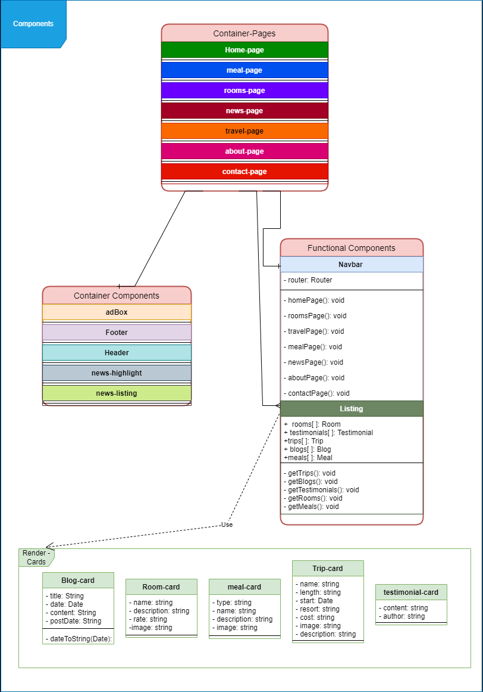
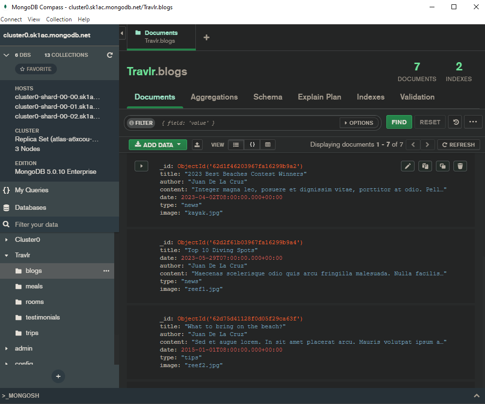

## Brandon's ePortfolio

### Introduction
This ePortfolio showcases the computer science skills I have learned throughout my time as an undergraduate at Southern New Hampshrie University. Its contents include a narrated code review, design and justification narratives, a professional self-assesment, and enhancements to previous work focused on key competencies related to software design & engineering, algorithims & datastructures, and databases. These enchaments are improvments made to old work done ealier in my studies here at Southern New Hamsphire University. 

### [Project files](https://github.com/Bstultz604/Bstultz604.github.io)

### Table Of Content
1. Professional Self-Assesment
2. Software Design & Engineering
3. Databases
4. Algorithims and Datastructures

# 1.) Professional Self-Assesment

   My journey in the field of computer science began in the spring of 2019. Throughout the last 4 years I have explored the many applications and practices of computer science. My study has revealed the importance of teamwork, professionalism, design, fundamentals, and security as the key pillars to success in this field. My work throughout the computer science program has sharpened my awareness of these crucial skills and has enabled me to hone their quality in relation to the works I produce as a software engineer. The obtainment of this foundational knowledge and skill is my first step into deeper and more fulfilling engagement with the professional field of computer science. 
  
	
  The cumulative skills and ability I have gained over the years have enabled me to produce a project to showcase my understanding of the core elements of computer science and my competencies in them. My project took a simple web application I had built earlier in my studies and redesigned/enhanced it. The enhancements I made to the project were made to highlight my competencies in the realms of software design and engineering, algorithms and data structures, and Databases. Software design and engineering are highlighted in my refactoring the design of the web app. My competency in data structures and algorithms are reveled in my use of algorithms to sort data inside the application. Database competency is seen in my design implementation of an external database for use in the app. These are all wrapped together into a single full stack application to highlight my skills and ability as a computer scientist.

# 2.) Software Design & Engineering

  The artifact I chose to make enhancements too is a simple express application. The program simply renders a static HTML web page. The goal of my enhancements is to refactor this web pages front end to utilize angular. These enchantments will showcase my ability to dissect the design elements of the web site while also being able to redesign these elements as modular components. These will add additional functionality to the front-end site and make the web site more modular, reusable, and dynamic. 
  
  The main sweep of enhancements required for this artifact was to decompose the original HTML to find what segments can be logically ordered as separate and individual components. Doing so revealed a few important component models. The first were the navbar and footer of the HTML. These portions of the HTML were designed to be clickable to the user to enable them to navigate to the different pages of the web page. These can be found at the top and bottom of every route page on the site, perfect candidates to be converted into angular components. 
  
  
  
  These were the first portions to be redesigned into modular components due to their ubiquitous use and important logical role in the web site. The logical code that dictates the behavior of the elements didn’t differ much between before and after the redesign. This is mostly due to the nature of the elements which was to route the user to different pages on the site. However, where they did differ was in the actual routing. In the original design the HTML elements, when clicked, would simply route the user to the designated static HTML page. After the redesign the routing instead led the user to a specially designed component that would serve up the component elements of the chosen page. This leads us to consider out next elements up for consideration to be refactored, the routing pages themselves. 
  
  The original artifact was comprised of static HTML pages that were switched between using the header and footer elements on every page. With the navbar and footer elements converted into angular components every page would now render with these at the top and bottom, showcasing their excellent modular design. However, the actual content of the page is still reliant on hard coded html. The pages themselves would need to be redesigned. I accomplished this by creating components for each page I wanted to route to. These include pages such as a home page, meal page, and news page. These components would serve two functions; a designator so the routing can be achieved and a container for the smaller components that make up each page.
  
  With the navbar, footer, and page container components created all that remained was the components that comprise the contents of each page. The main components that I utilized in the refactor of these content components was a simple listing component. These were the most dynamic modular elements I designed and added into the refactor process. They served as the main content of all the pages the user can see. The component is simply a container that is used to hold data that was to be retrieved from a data a base. I designed the component to be passed a ‘data’ variable that would inform the component which API call it should use to retrieve and display the correct data. This enabled the component to be highly reusable. Showcasing my ability to creatively solve design issues while also promoting design goals such as modularity and ease of use.
  
  The skills of this artifact enhancement demonstrate three important proficiencies. The first proficiency demonstrated is my ability to employ strategies for building collaborative environments. The second proficiency is the ability to design, develop, and deliver professional-quality oral, written, and visual communications that are coherent, technically sound, and appropriately adapted to specific audiences and contexts. The third proficiency is my ability to use well-founded and innovative techniques, skills, and tools in computing practices for the purpose of implementing computer solutions that deliver value and accomplish industry-specific goals.
  
  My proficiency in employing strategies for building collaborative environments were developed and implemented in this enhancement. The first of the collaborative design choices I made in this enhancement was to utilize version control systems to track and control the design of this enchantment and the future enhancements as well. The version control system git enabled me to better develop and test my work. These changes were then stored in a git repository on GitHub, accessible to any potential future collaborators. In addition to using version control I also ensured the use of explanatory code comments. This enables future developers, inducing myself, to follow the flow of logic of the application more easily. This promotes a higher quality collaborative environment.
  
  Proficiency in the design and delivery of professional communication can be seen in both the supporting narrative of this enhancement as well is the actual redesign itself. The narrative I provided clearly elaborated the decisions I made throughout the design process. In addition to the narrative, I had produced a design document that illustrates the key elements of my redesign process, showcasing my decomposition of the original artifact and redesigned it to use the angular. This document alone serves as a great professional communication device, when combined with the narrative a complete picture of my design process is revealed. Together they highlight my competency to produce professional communication.
  
  Competent proficiency in my ability to use well-founded and innovative techniques, skills, and tools in computing practices is best highlighted in the design document and the implementation of that design. The design document shows my attention placed on redesigning the system to be more modular and dynamic. My implementation of this design document also used the perspective of the user a key guide for constructing the key elements. All while ensuring my code was well commented to support future development. When paired together my competency can be seen in my attention to the best practices of creating modular and user-friendly code.
  

# 3.) Databases  
  
  The artifact in question that was enhanced was a simple express application that would render static html code. The original artifact had no database connected nor any dynamic ways of interacting with data. All aspects of the rendering were hard coded. The lack of a database was my key focus in making enhancements. The goal of my enhancement was to make the rendering of the site more dynamic by utilizing an external database to deliver data to be displayed.
  
  The process of making this enhancement can be broken down into three distinct parts. First is in the type of database I chose and the provider that delivers the service. Second is the API used to access the data store. Third was how to enable the site to render this data. When combined these portions showcase my ability to set up database solutions for my project and how to access and manipulate data from a database.
  
  The database type I chose was a NoSQL one and more specifically MongoDB Atlas. The backend of the application uses Node.js which ensures NoSQL fits nicely with my full stack development using BSON data documents. This making integration very easy. In addition, I required the use of a cloud-based database so that data could be accessed from anywhere, this led me to choose MongoDB atlas to serve my database and cloud requirements.
  
  With my database type and provider decided I now needed to develop the crucial enhancements. The first of these enhancements was the creation of the backend to connect to the newly created mongoDB database. I used mongoose libraries to accomplish this task. I also added error detection to this initial connection to detect when and why a connection issue has occurred. After the initial connection to the database, I needed a way to access this data. I first needed to model the type of data I was to collect. To accomplish this, I used mongoose schemas to model the structure of the data I was expecting to receive from calls to the database. This enabled the application to generate these data calls as distinct JSON objects that will make future data manipulation easier. After modeling my collections, I needed to generate the appropriate code to request data from the database. These were designed as methods that asynchronously communicated with the connected database.
  
  
  
  Finally with my database connected I needed a way to retrieve the data in such a way to make it usable for the purposes of my application. This is where my middleware was required. Previously I had designed my methods to be associated with specific API end points. Such as ‘/trips’ which would have the different methods associated with it depending on the http protocol that was used like, get or post. The middleware I designed would simply make a http request from the associated host to the connected database, it would then return a response, typically in JSON format which I would then use in my angular files to render.
  
  A simple example would be the user would traverse to the news page of the application. Upon routing to the new page, the middleware would make a get request to the database. The backend would recognize the extension of the API router and make the ‘get’ data request to the server using the asynchronous methods defined earlier. The database would then send the response, which would be converted to JSON before being passed back to the middleware and added to a simple data structure to hold the newly arrived data. This data structure would then be used to iterate over to display the whole list or simply called if a single item was returned. In this manner I can populate listing components from my angular front end with specific data from my database, creating a dynamic application. 
  
  In summery I utilized mongoDB atlas to fulfill my need for a way to store data in a cloud-based environment so that it can be accessed from anywhere. I developed a proper backend to model this data and make calls to the database. I then designed middleware so that my backend and frontend can communicate to properly service the requests necessary to render the data as needed. These effectively showcase my skill and ability to both analyze the needs of the system in question but also how to implement them effectively to produce results for the project.
  
# 4.) Algorithims and Datastructures

 The artifact that is to be enhanced began as a simple express application that rendered HTML in a static manner; loading data that was hardcoded to be loaded. Over the past few weeks have added more dynamic features to this original artifact. Converting its front-end rendering to use angular, and to add an external database to help the application render dynamically. This enhanced artifact is where my new changes will be applied.

Regarding the algorithms and data structures enhancement I had gone through different ideas before finally settling one clear improvement. The goal of the improvement was to have an algorithm or data structure that could be used to sort data retrieved from the API to the database so that it can be displayed to the user in reverse order by date. In my first conceptualization of the enhancement, I had wanted to utilize a sorting algorithm that was to be paired with a stack data structure. The idea was to use the sorting algorithm to sort the elements of the API data by their converted ‘date’ variable. As it sorted the data it could populate the stack data structure with the oldest objects first. This would naturally create a list of elements that when accessed would return elements in reverse order. This idea was originally considered because I wanted the sorted elements from the API to be stored for later use. Enabling quick access to the correctly sorted data. It would have also enabled new elements to be added easily while pushing old ones out, creating a dynamic list of the most recent additions to the data set. This idea did however have a flaw. The main flaw was the unnecessary data structure.

The use of the stack in this initial conceptualization would not have provided the correct behavior and was scrapped for this reason. The idea was to have an external data structure to hold the API data so that it could later be called and used to render the data as previously mentioned, in reverse order by date. This would have allowed for the sorting algorithm to only need to be used once in the initial sort. Then any subsequent additions to the data set would have just been pushed to the top of the stack, removing an element form the bottom. Generating a dynamic list of ordered elements. This was not possible however due to the way the application was designed to display data. I had it set up such that the application would make a API call to the data base to retrieve data which would then be passed to my listing component which iterates over every element from the call and displays their elements as requested. This means that I would have needed to make my API call earlier to retrieve that data, sort it, and place it in the data structure. This data structure would then need to be passed to the listing component instead of initial data from the database. This could potentially lead to issues of correctness due to the disconnect between the actual data in the database and the data structure itself. That is why I simply went with enhancing the artifact with just the use of a sorting algorithm.

The use of only the sorting algorithm alone would accomplish my enhancements goals of displaying a list of the most recent added data to the user without the unnecessary additional complexity of the auxiliary stack structure. I implemented my enhancement using a merge sort algorithm that is used to sort contents of an API call in reverse chronological order before it was passed to my rendering components. This was necessary since the data in the database is not sorted, thus when calls get made to the database the structure returned is also unsorted. The addition of the merge sort algorithm acts as a filter between the database and the elements used to display data to the user. The algorithm simply converts the structure of the data to display the results in the manner required; in this case with the results showing a list of the most recent additions to the data set.

In this enhancement I utilized algorithms to sort retrieved data from the database such that it could be displayed to the user properly. The way it is designed enables this algorithm to be used in other parts of the application, this promotes modularity. The application is now capable of altering the initial structure of the data from the database to suite the needs of the components and the user.

The skills of this artifact enhancement demonstrate a key proficiency. The proficiency demonstrated is my ability to design and evaluate computing solutions that solve a given problem using algorithmic principles and computer science practices. This proficiency to design computing solutions to a given problem using algorithmic principles is clearly seen in the enhancement itself. I saw that the data needed to be sorted in a specific manner before being presented to the user. Thus, I evaluated the issue and designed a solution using algorithmic principles to resolve said issue with a merge sort algorithm.

